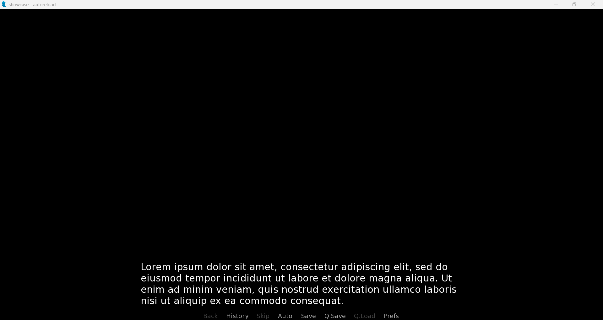
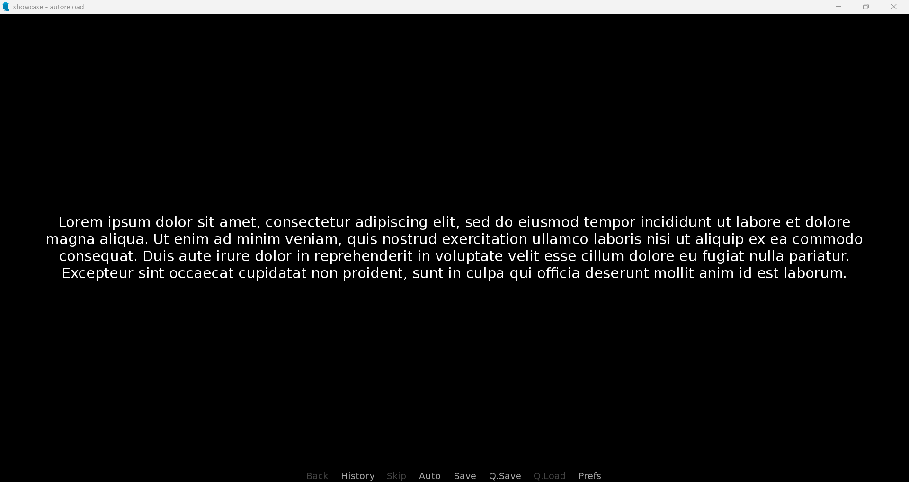
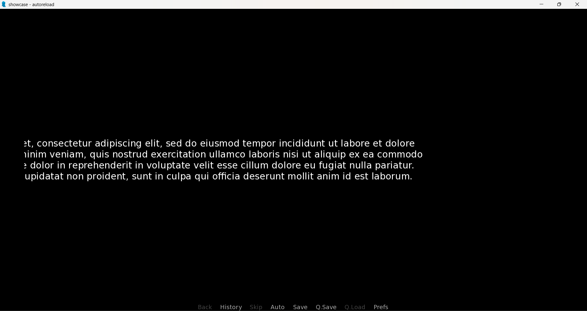
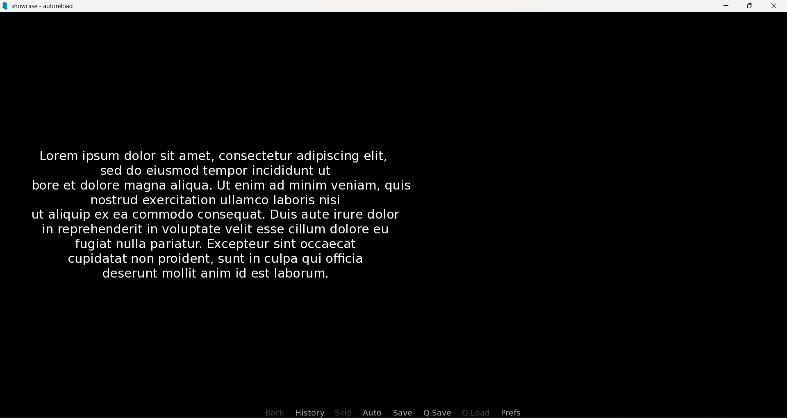
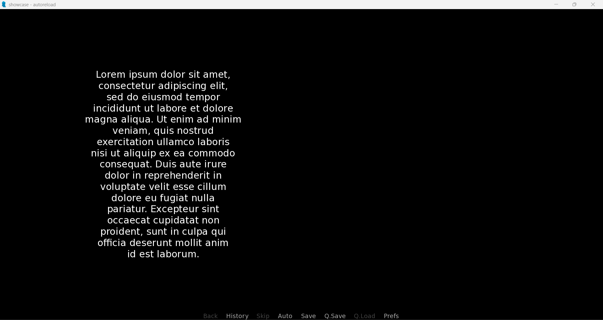

# renpy-line-brkr
A command-line program which adds newline characters to your Text Displayables in your Ren'Py files.

## Introduction
As said on [Ren'Py's Website](https://www.renpy.org/), "Ren'Py is a visual novel engine – used by thousands of creators from around the world – that helps you use words, images, and sounds to tell interactive stories that run on computers and mobile devices." 

By default, Ren'Py displays any [Say Statement](https://www.renpy.org/doc/html/dialogue.html#say-statement) dialogue at a set position on the screen. For most developers, this default position is perfectly fine, and they can easily tailor this position to their needs if needed. However, this position remains the same for all Say Statement text. 

For example, a normal Ren'Py say statement such as:
```
"Lorem ipsum dolor sit amet, consectetur adipiscing elit, sed do eiusmod tempor incididunt ut labore et dolore magna aliqua. Ut enim ad minim veniam, quis nostrud exercitation ullamco laboris nisi ut aliquip ex ea commodo consequat."
pause
```
In your `script.rpy` file will render the Say Statement like this:



This isn't inherently problematic, but for developers who desire more freedom when it comes to positioning text on the screen their options are Text Displayables. Ren'Py [Text Displayables](https://www.renpy.org/doc/html/text.html#text-displayables) empower developers to position text anywhere on screen, but at the cost of developer flexibility. Unlike other common forms of Ren'Py [Text](https://www.renpy.org/doc/html/text.html), Text Displayables are treated as *images* instead of character data. As a result, Text Displayables have the possibility of rendering text off-screen if they're not positioned correctly.

For example, Ren'Py will center and break text within a Text Displayable as if it were centered on screen, so the following Text Displayable (including the *pause* keyword):
```
show text "Lorem ipsum dolor sit amet, consectetur adipiscing elit, sed do eiusmod tempor incididunt ut labore et dolore magna aliqua. Ut enim ad minim veniam, quis nostrud exercitation ullamco laboris nisi ut aliquip ex ea commodo consequat. Duis aute irure dolor in reprehenderit in voluptate velit esse cillum dolore eu fugiat nulla pariatur. Excepteur sint occaecat cupidatat non proident, sunt in culpa qui officia deserunt mollit anim id est laborum."
pause
```
In your `script.rpy` file will render the Text Displayable like this:



However, if you position the Text Displayable using Ren'Py [Animation and Transformation Language](https://www.renpy.org/doc/html/atl.html) anywhere else (in this case at 25% of the x axis):
```
show text "Lorem ipsum dolor sit amet, consectetur adipiscing elit, sed do eiusmod tempor incididunt ut labore et dolore magna aliqua. Ut enim ad minim veniam, quis nostrud exercitation ullamco laboris nisi ut aliquip ex ea commodo consequat. Duis aute irure dolor in reprehenderit in voluptate velit esse cillum dolore eu fugiat nulla pariatur. Excepteur sint occaecat cupidatat non proident, sunt in culpa qui officia deserunt mollit anim id est laborum.":
    pos(0.25, 0.5)
pause
```
Will render the Text Displayable off-screen like this:



The only way a developer can resolve this is by manually inserting Ren'Py newline characters (\n) within the text itself. Thus, to get the previous esxample to fully render on screen, you'd need to break the lines like this:
```
show text "Lorem ipsum dolor sit amet, consectetur adipiscing elit,\n sed do eiusmod tempor incididunt ut\n labore et dolore magna aliqua. Ut enim ad minim veniam, quis\n nostrud exercitation ullamco laboris nisi\n ut aliquip ex ea commodo consequat. Duis aute irure dolor\n in reprehenderit in voluptate velit esse cillum dolore eu\n fugiat nulla pariatur. Excepteur sint occaecat\n cupidatat non proident, sunt in culpa qui officia\n deserunt mollit anim id est laborum.":
    pos(0.25,0.5)
pause
```
So Ren'Py will render the Text Displayable like this:



While doing one Text Displayable is perfectly feasible, if a developer wanted to present their visual novel in a more dynamic style (like a comic book or mangaka for example) they're worflow is reptitive to say the least. Micromanaging the line breaks in tens to hundreds of Ren'Py Text Displayables in one visual novel is oppressively tedious... but not anymore!

Introducing `line_brkr.py` a python program which uses a command-line interface to programmatically break your Ren'Py Text Displayables' lines to make them a easier to use!

For example, instead of inserting the newlines manually, you can enter this command (assuming `line_brkr.py` is in the same directory as your Ren'Py Project)
```
python line_brkr.py -r script.rpy -o -t 30
```
To turn this old example:
```
show text "Lorem ipsum dolor sit amet, consectetur adipiscing elit, sed do eiusmod tempor incididunt ut labore et dolore magna aliqua. Ut enim ad minim veniam, quis nostrud exercitation ullamco laboris nisi ut aliquip ex ea commodo consequat. Duis aute irure dolor in reprehenderit in voluptate velit esse cillum dolore eu fugiat nulla pariatur. Excepteur sint occaecat cupidatat non proident, sunt in culpa qui officia deserunt mollit anim id est laborum.":
    pos(0.25, 0.5)
pause
```
To this:
```
show text "Lorem ipsum dolor sit amet,\nconsectetur adipiscing elit,\nsed do eiusmod tempor\nincididunt ut labore et dolore\nmagna aliqua. Ut enim ad minim\nveniam, quis nostrud\nexercitation ullamco laboris\nnisi ut aliquip ex ea commodo\nconsequat. Duis aute irure\ndolor in reprehenderit in\nvoluptate velit esse cillum\ndolore eu fugiat nulla\npariatur. Excepteur sint\noccaecat cupidatat non\nproident, sunt in culpa qui\nofficia deserunt mollit anim\nid est laborum.":
    pos(0.25,0.5)
pause
```
To render this:



In *microseconds*. 

If this is interesting 

<br/>

## User Guide
asdads

<br/>

### Overview & Use

<br/>

### Required Flags

<br/>

#### Read Flag
-r/--read  

<br/>

#### Write Flags
##### Write
-w/--write

<br/>

##### Overwrite
-o/--overwrite

<br/>

### Optional Flags
Ordered by relevancy

<br/>

#### Text Length Flag
-t/--text-length

<br/>

#### Line Inclusion/Exclusion Flags
##### -x/--exclude-line & -n/--include-line

<br/>

##### Argument Format

<br/>

#### Data Length Flag
-d/--data-length

<br/>

#### Image Length Flag
-i/--image-length

<br/>


#### Space Length Flag
-s/--space-length

<br/>


## Program Behavior
